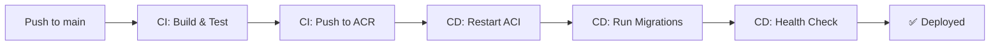

# GitHub Actions Workflows

## Overview

This project uses 2 GitHub Actions workflows for CI/CD:

### 1. CI Pipeline (`ci.yml`)

**Purpose:** Continuous Integration - Test, Lint, and Build

**Triggers:**
- Pull requests to `main` or `develop`
- Pushes to `main` or `develop`

**Jobs:**
1. **Lint** - Code quality checks (flake8, black, isort)
2. **Test** - Run tests with PostgreSQL and Redis
3. **Build** - Build and push Docker image to ACR

**Required Secrets:**
- `AZURE_CONTAINER_REGISTRY` - ACR name (e.g., `acrpublicshoppoc.azurecr.io`)
- `AZURE_CONTAINER_REGISTRY_USERNAME` - ACR username
- `AZURE_CONTAINER_REGISTRY_PASSWORD` - ACR password

---

### 2. CD Pipeline (`cd.yml`)

**Purpose:** Continuous Deployment - Deploy to Azure Container Instances

**Triggers:**
- Push to `main` branch
- Manual workflow dispatch (with environment selection)

**Jobs:**
1. **Build and Push** - Build Docker image and push to ACR
2. **Deploy** - Deploy to Azure Container Instances
   - Restart app container
   - Wait for container to be ready
   - Run database migrations
   - Health check
   - Get deployment info
3. **Notify** - Send deployment status

**Required Secrets:**
- `AZURE_CREDENTIALS` - Service Principal JSON
- `AZURE_CONTAINER_REGISTRY` - ACR name
- `AZURE_CONTAINER_REGISTRY_USERNAME` - ACR username
- `AZURE_CONTAINER_REGISTRY_PASSWORD` - ACR password

---

## Setup GitHub Secrets

### 1. Go to Repository Settings
1. Navigate to your GitHub repository
2. Click **Settings** → **Secrets and variables** → **Actions**
3. Click **New repository secret**

### 2. Add Required Secrets

#### AZURE_CREDENTIALS

Service Principal JSON (from Azure):

```bash
az ad sp create-for-rbac \
  --name "github-actions-public-shop" \
  --role contributor \
  --scopes /subscriptions/{subscription-id} \
  --sdk-auth
```

Copy the entire JSON output.

#### AZURE_CONTAINER_REGISTRY

```
acrpublicshoppoc.azurecr.io
```

#### AZURE_CONTAINER_REGISTRY_USERNAME

```
acrpublicshoppoc
```

#### AZURE_CONTAINER_REGISTRY_PASSWORD

Get from Azure:

```bash
az acr credential show --name acrpublicshoppoc --query "passwords[0].value" -o tsv
```

---

## Deployment Flow



---

## Manual Deployment

To manually trigger a deployment:

1. Go to **Actions** tab
2. Select **CD Pipeline - ACI Deployment**
3. Click **Run workflow**
4. Select environment (poc/prod/staging)
5. Click **Run workflow**

---

## Monitoring Deployments

### View Logs in GitHub
1. Go to **Actions** tab
2. Click on the workflow run
3. View job logs

### View Azure Container Logs
```bash
az container logs \
  --resource-group rg-public-shop-poc \
  --name aci-app-public-shop-poc \
  --container-name app
```

### Check Container Status
```bash
az container show \
  --resource-group rg-public-shop-poc \
  --name aci-app-public-shop-poc \
  --query "{State:instanceView.state, RestartCount:containers[0].instanceView.restartCount}"
```

---

## Troubleshooting

### Build Fails
- Check if all secrets are configured correctly
- Verify ACR credentials are valid
- Check Docker build logs

### Deployment Fails
- Check container logs in Azure
- Verify all Azure resources exist
- Check if image was pushed to ACR successfully

### Health Check Fails
- Verify application is running in container
- Check database and Redis connections
- Review application logs

---

## Environment Variables in CD

The following environment variables are configured in the workflow:

```yaml
AZURE_RESOURCE_GROUP: rg-public-shop-poc
APP_CONTAINER_NAME: aci-app-public-shop-poc
POSTGRES_CONTAINER_NAME: aci-postgres-public-shop-poc
REDIS_CONTAINER_NAME: aci-redis-public-shop-poc
ACR_NAME: acrpublicshoppoc
```

Update these if your resource names are different.

